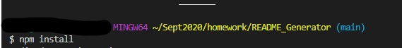
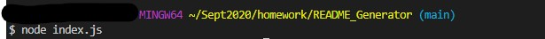
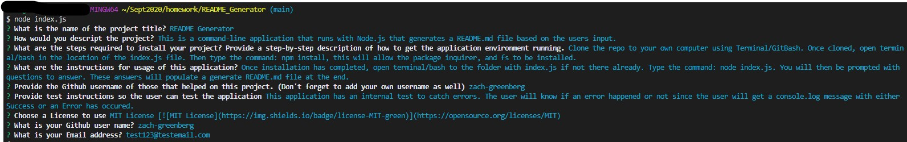

# README Generator
## Description
This is a command-line application that runs with Node.js that generates a README.md file based on the users input.

* [Installation](#Installation)

* [Usage](#Usage)

* [License](#License)

* [Contributors](#Contributors)

* [Tests](#Tests)

* [Questions](#Questions)

## Installation
Clone the repo to your own computer using Terminal/GitBash. Once cloned, open terminal/bash in the location of the index.js file. Then type the command: npm install, this will allow the package inquirer, and fs to be installed.

## Usage
Once installation has completed, open terminal/bash to the folder with index.js if not there already. Type the command: node index.js. You will then be prompted with questions to answer. These answers will populate a generate README.md file at the end.

## License 
This project is licensed under the MIT License 

## Contributors
zach-greenberg

## Tests
This application has an internal test to catch errors. The user will know if an error happened or not since the user will get a console.log message with either Success or an Error has occured.

## Questions
**Please ask any questions to the following**

Email: test123@testemail.com

GitHub: https://github.com/zach-greenberg